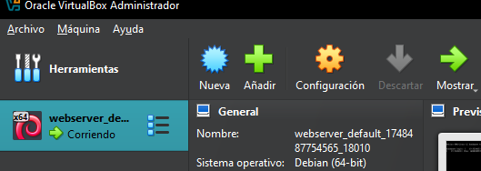
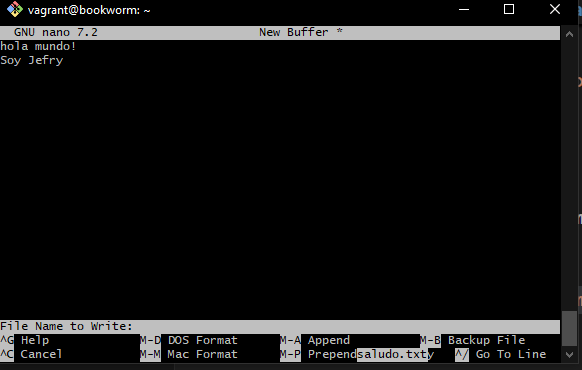
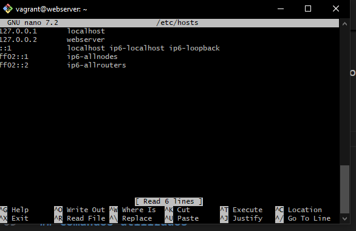
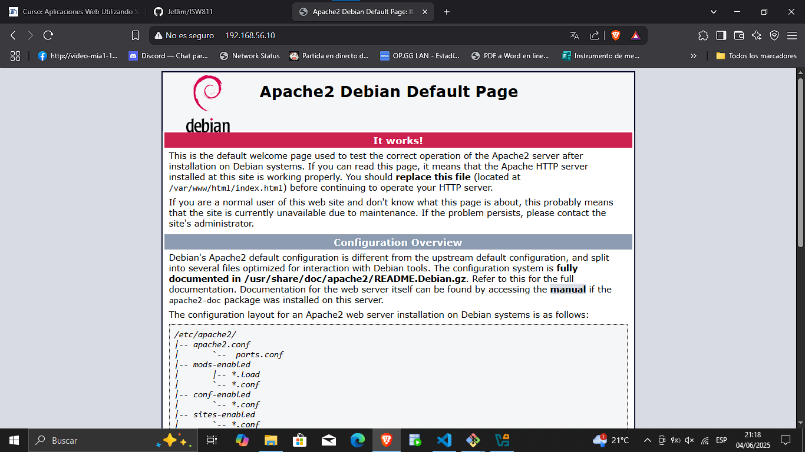
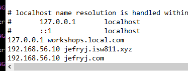

# Workshop02 - LAMP on Debian

## Pasos realizados en clases 

Vimos un resumen de LAMP presentada por el profe Misael al incio de clases y de elementos que intervienen en la publicación de una web y arrancando la VM _Debian/Bookworm_.

Posterior arrancamos la máquina virtual

```bash
cd C/Users/jefry/OneDrive/Documentos/ISW811/VMs/webserver
vagrant up
```

Podemos verificar que la máquina está en ejecución desde VB



Posterior creamos una nueva carpeta "Workshop02" con el README.md y subirlo a git en la carpeta M

```bash
cd c/Users/jefry/OneDrive/Documentos/ISW811/M
mkdir Workshop02
touch README.md
mkdir images
git add README.md /images
git commit "Inicializar repositorio"
git push
```

Continuamos con la enseñanza de comprimir un archivo taz.gz "Workshop02-Jefry.tar.gz" para posterior subirlo al campus

```bash
tar cvfz Workshop02-Jefry.tar.gz Workshop02
```

Nos movemos a donde está la VM para acceder mediante SSH

```bash
cd c/Users/jefry/OneDrive/Documentos/ISW811/VMs/webserver
vagrant up
vagrant ssh
```

Creamos un archivo nuevo con el comando nano y agregamos el texto "Hola mundo soy Jefry" y ejecutamos le combinación de teclas ctrl+o para guardar con el nombre "saludo.txt" y nos salimos del editor de texto con ctrl+x

```bash
nano
```




Ahora vamos a cambiar el nombre host una vez conectados en a la VM, aplicando los mismos pasos de antes solo borramos el nombre bookworm y ponemos webserver

```bash
sudo hostnamectl set-hostname webserver
sudo nano /etc/hosts

```




## Instalando paqueteria

Instalando paqueteria necesaria para el webserver dentro de la máquina virtual


```bash
sudo apt-get install apache2 mariadb-server mariadb-client vim vim-nox curl php8.2 php8.2-curl php8.2-bcmath php8.2-mysql php8.2-mcrypt php8.2-xml php8.2-zip php8.2-mbstring
```

## Más pasos generales hechos en clases

Abrimos un navegador web y buscamos "http://192.168.56.10" y de esta manera logramos ver el servidor en esta ip



Luego en la máquina principal vamos a c/Windows/System32/drivers/etc y luego ejecutamos

```bash
notepad hosts 
```

Este nos abre un bloc de notas para editar y debemos agregar unos nombres de rutas para acceder mediante este dns




## Comandos utilizados en toda la clase

### Comandos básicos de terminal
- `cd`: Nos permite navegar entre directorios
- `mkdir`: Crea un nuevo directorio/carpeta
- `ls` / `ls -la`: Lista archivos y la segunda nos permite ver archivos ocultos
- `file`: + nombreDeArchivo nos permite ver que tipo de archivo es
- `pwd`: Muestra la ruta actual
- `touch`: Crea un archivo vacío
- `code`: Para abrir Visual Studio Code
- `tar cvfz "nombreFinalArchivo" "CarpetaAComprimir"`: Este comando se utiliza para comprimir archivos 
- `notepad`: Para abrir el archivo a editar

### Comandos Vagrant
- `vagrant init`: Inicializa el entorno Vagrant
- `vagrant up`: Iniciar la máquina virtual
- `vagrant status`: Muestra el estado de la VM
- `vagrant ssh`: Conectar a la VM via SSH
- `vagrant halt`: Apagar la VM
- `sudo nano /etc/hosts`: acceder al archivos hosts para cambiar el nombre
- `vagrant halt`: Apagar la VM

### Comandos de red y sistema
- `ping`: Verificar conexión 
- `sudo`: Ejectutar comandos con previlegios de super usuario
- `apt-get update`: Actualizar paquetes del sistema
- `apt-get install`: Instalar paquetes
