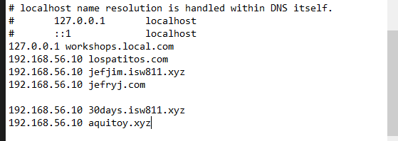

# Workshop03 - Proxy reverso con Apache2

## Pasos realizados en clases 
    ñ
Accedemos al archivo vagrant file con "code vagrantfile" y vamos v  a modificar la linea 46 y añadir "config.vm.synced_folder "sites/", "/vagrant/sites", owner: "www-data", group: "www-data" " y luego descomentar las líneas 60, 65, 66. 

```bash
60:"  config.vm.provider "virtualbox" do |vb|", 
65: "vb.memory = "2048"", 
66:"end"
```
Posterior crear la carpeta sites y otra carpeta confs en la carpeta webserver, y arrancamos la máquina virtual

```bash
mkdir sites
vagrant up
```

Continuamos añadiendo 2 carpetas en sites llamadas lospatitos.com y la personalizada en mi caso jefjim.isw811.xyz y luego en y luego dentro de lospatitos crear index.html, luego otra carpeta images y descargar una imagen y guardala acá para usarla luego y crear la carpeta assets con el archivo styles.css


Crear una página de prueba en index.html y darle ciertos estilos y luego vamos a deployarla. En la consola local crear el archivo "lospatitos.com.conf"

```bash
cd confs/
touch lospatitos.com.conf
```
Y pegar la siguiente información en el archivo

```bash
<VirtualHost *:80>
    ServerAdmin webmaster@lospatitos.com
    ServerName lospatitos.com

    DirectoryIndex index.php index.html
    DocumentRoot /vagrant/sites/lospatitos.com

    <Directory /vagrant/sites/lospatitos.com>
        AllowOverride All
        Require all granted
    </Directory>

    ErrorLog ${APACHE_LOG_DIR}/lospatitos.com.error.log
    CustomLog ${APACHE_LOG_DIR}/lospatitos.com.access.log combined
</VirtualHost>
```
Guardamos el archivo y luego ingresamos en la VM con vagrant ssh, vamos a la ruta /vagrant/ y ejecutamos los siguientes comandos

```bash
cd /vagrant/
sudo cp confs/lospatitos.com.conf /etc/apache2/sites-available/
echo "ServerName webserver" | sudo tee -a /etc/apache2/apache2.conf
sudo apache2ctl -t
```
Si hasta aquí vamos bien, nos indicará un Syntax OK

Luego verificamos que a2enmod este habilitado con los siguientes comandos, en caso de estar apagado usar la segundo línea también

```bash
sudo a2enmod vhost_alias
sudo systemctl restart apache2
```



## Comandos utilizados en toda la clase

### Comandos básicos de terminal
- `cd`: Nos permite navegar entre directorios
- `mkdir`: Crea un nuevo directorio/carpeta
- `ls` / `ls -la`: Lista archivos y la segunda nos permite ver archivos ocultos
- `file`: + nombreDeArchivo nos permite ver que tipo de archivo es
- `pwd`: Muestra la ruta actual
- `touch`: Crea un archivo vacío
- `code`: Para abrir Visual Studio Code
- `tar cvfz "nombreFinalArchivo" "CarpetaAComprimir"`: Este comando se utiliza para comprimir archivos 
- `notepad`: Para abrir el archivo a editar
- `rmdir`: Lista archivos y la segunda nos permite ver archivos ocultos

### Comandos Vagrant
- `vagrant init`: Inicializa el entorno Vagrant
- `vagrant up`: Iniciar la máquina virtual
- `vagrant status`: Muestra el estado de la VM
- `vagrant ssh`: Conectar a la VM via SSH
- `vagrant halt`: Apagar la VM
- `sudo nano /etc/hosts`: acceder al archivos hosts para cambiar el nombre
- `vagrant halt`: Apagar la VM

### Comandos de red y sistema
- `ping`: Verificar conexión 
- `sudo`: Ejectutar comandos con previlegios de super usuario
- `apt-get update`: Actualizar paquetes del sistema
- `apt-get install`: Instalar paquetes
