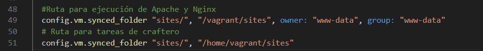
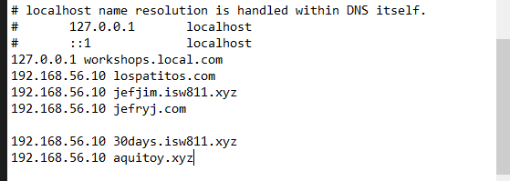

# Workshop04 - Desplegar Lavarel y certificados SSL

## Pasos realizados en clases 

### Editamos Vagrant    
Entramos al archivo vagrantfile para hacer cambios desde la consola 

```bash
code vagrantfile
```
Vamos a la linea 47, la copiamos la línea y pegamos debajo y dejarla de la siguiente manera:



### Editando archivo host

Acceder al archivo en "c:\Windows\system32\drivers\etc" con cmd en modo administrador y editar el archivo hosts con "notepad hosts" y agregar la entrada "192.168.56.10 30days.isw811.xyz" y "192.168.56.10 aquitoy.xyz"



### Agregar nuevos archivos confs 

Ahora añadimos nuevos archivos conf para las nuevas rutas creadas copiando la de lospatitos.com.conf de la siguiente manera

```bash
cp lospatitos.com.conf 30days.isw811.xyz.conf
cp lospatitos.com.conf aquitoy.xyz.conf
```
Ahora los editamos, para facilitar el cambio de todas las lineas seleccionar el texto que queremos cambiar y con la combinación [CTRL+D] seleccionamos todas las lineas iguales, esto nos permite una rápida edición


Si hasta aquí vamos bien, nos indicará un Syntax OK con el comando "sudo apache2ctl -t"

### Editar archivo 
Accedemos a webserver/sites en la máquina local, luego "code ." para acceder a todo el repositorio y editamos las siguientes lineas del archivo .env


### Crear database
En la carpeta VMs crear la carpeta database, luego crear un vagrant file con el "vagrant init", una vez creada esta máquina accedemos a editar su información "code Vagrantfile", en la línea 35 cambiar los ultimos dos octetos con el de nuestra red, "192.168.56.12"

```bash
mkdir database 
cd database
vagrant init debian/bookworm64
code Vagrantfile
```


### Configuración de la DB
Accedemos a la VM que va a ser la DB, en la carpeta database, una vez conectados vemos el nombre "bookworm" y lo vamos a cambiar con el comando "sudo hostnamectl set-hostname database" y luego "sudo nano /etc/hosts", una vez abierto el archivo borramos la palabra bookworm y agregamos database para guardar [CTRL+O] y para salir [CTRL+X], hacemos comando exit y volvemos a logear con el vagrant ssh para ver los cambios efectuados

```bash
vagrant up
vagrant ssh
sudo hostnamectl set-hostname database
sudo nano /etc/hosts
exit
vagrant ssh
```


### Configuración de la DB parte 2
Una vez conectados de nuevo, ejecutamos el comando "sudo apt-get update" y luego "sudo apt install mariadb-server mariadb-client" y luego editamos el archivo de mariadb "sudo nano /etc/mysql/mariadb.conf.d/50-server.cnf" para permitir el acceso remoto y comentamos la linea 27 o la que diga "bind-address" y guardamos [CTRL+O] y [CTRL+X] para salir y aplicamos "sudo systemctl restart mysql" de esta manera ya es accesible remotamente, continuamos con "sudo mysql", creamos una DB " create database 30days;" creamos un usuario " create user laravel identified by 'secret';", le damos privilegios " grant all privileges on 30days.* to laravel;" y continuamos con " flush privileges;" y cerramos la CLI de maria con "quit"

```bash
sudo apt-get update
sudo apt install mariadb-server mariadb-client
sudo nano /etc/mysql/mariadb.conf.d/50-server.cnf
sudo systemctl restart mysql
create database 30days
create user laravel identified by 'secret';
grant all privileges on 30days.* to laravel;
flush privileges;
quit
```
### Separar responsabilidades 
Accedemos a la VM webserver y vamos a eliminar mariadb con el comando "sudo apt remove mariadb-server" con el fin de hacer una separación de responsabilidades

```bash
sudo apt remove mariadb-server
```

Luego en la máquina anfitriona acceder a webserver, luego sites/30days.isw811.xyz y utilizar el comando "code ." y acceder al archivo .env y editar la linea 25 y ccambiar el ip DB_HOST a "192.168.56.12" y guardamos.

Vamos a la consola con el webserver y accedemos a la carpeta 30days, luego ejecutamos el comando "php artisan migrate"

```bash
cd sites/30days.isw811.xyz
sudo php artisan migrate
```

### Añadiendo certificado 
Primero creamos la carpeta ssl en webserver, luego de telegram descargamos el archivo "certificado_30days.isw811.xyz.tar" y el archivo "options-ssl-apache.conf, y lo pegamos en la carpeta webserver/ssl de la máquina local y lo descomprimimos con el comando "tar xvfz certificado_30days.isw811.xyz.tar.gz"

```bash
cd webserver/
mkdir ssl
cd ssl/
tar xvfz certificado_30days.isw811.xyz.tar.gz

```
Luego accedemos a la carpeta confs, y le sacamos copia al archivo 30days.isw811.xyz.conf con el comando "cp 30days.isw811.xyz.conf 30days.isw811.xyz-le-ssl.conf" y luego hacemos cambios en los archivos con "code ."

```bash
cd webserver/confs
cp 30days.isw811.xyz.conf 30days.isw811.xyz-le-ssl.conf
code .
```
### Editando archivos
Editamos el archivo con el sufijo "le-ssl" y debe quedar de la siguente manera;
```bash
    <IfModule mod_ssl.c>
    <VirtualHost *:443>
    ServerAdmin webmaster@30days.isw811.xyz
    ServerName 30days.isw811.xyz

    DirectoryIndex index.php index.html
    DocumentRoot /vagrant/sites/30days.isw811.xyz/public

    <Directory /vagrant/sites/30days.isw811.xyz/public>
        DirectoryIndex index.php index.html
        AllowOverride All
        Require all granted
    </Directory>

    ErrorLog ${APACHE_LOG_DIR}/30days.isw811.xyz.error.log
    LogLevel warn
    CustomLog ${APACHE_LOG_DIR}/30days.isw811.xyz.access.log combined

    Include /vagrant/ssl/options-ssl-apache.conf
    SSLCertificateFile /vagrant/ssl/30days.isw811.xyz/fullchain.pem
    SSLCertificateKeyFile /vagrant/ssl/30days.isw811.xyz/privkey.pem
    </VirtualHost>
    </IfModule>

```
Y el archivo original o sin el sufijo debe quedar de la siguiente manera

```bash
    <VirtualHost *:80>
    ServerAdmin webmaster@30days.isw811.xyz
    ServerName 30days.isw811.xyz

    DirectoryIndex index.php index.html
    DocumentRoot /vagrant/sites/30days.isw811.xyz/public

    <Directory /vagrant/sites/30days.isw811.xyz/public>
        AllowOverride All
        Require all granted
    </Directory>

    ErrorLog ${APACHE_LOG_DIR}/30days.isw811.xyz.error.log
    CustomLog ${APACHE_LOG_DIR}/30days.isw811.xyz.access.log combined

    RewriteEngine on
    RewriteCond %{SERVER_NAME} =www.30days.isw811.xyz [OR]
    RewriteCond %{SERVER_NAME} =30days.isw811.xyz
    RewriteRule ^ https://%{SERVER_NAME}%{REQUEST_URI} [END,NE,R=permanent]
    </VirtualHost> 
```


### Configuraciones adicionales en webserver
Accedemos a la terminal de la VM webserver, vamos a "cd /vagrant/confs/" y copiamos los archivos con el comando "sudo cp 30days* /etc/apache2/sites-available/" y verificamos con "sudo a2ensite 30days.isw811.xyz-le-ssl.conf" y para activar la nueva configuración aplicamos "sudo a2enmod rewrite ssl" y luego "sudo systemctl reload apache2" y verificamos la conexión "sudo apache2ctl -t" debe de decir Syntax OK

```bash
cd 
cd /vagrant/confs/
sudo cp 30days* /etc/apache2/sites-available/
sudo a2ensite 30days.isw811.xyz-le-ssl.conf
sudo a2enmod rewrite ssl
sudo systemctl reload apache2
sudo apache2ctl -t

``` 
### Comentrarios finales
Una vez implementadas todas estas configuraciones, deberiamos ver el mensaje de conexión segura, además de la página en funcionamiento


## Comandos utilizados en toda la clase

### Comandos básicos de terminal
- `cd`: Nos permite navegar entre directorios
- `mkdir`: Crea un nuevo directorio/carpeta
- `ls` / `ls -la`: Lista archivos y la segunda nos permite ver archivos ocultos
- `file`: + nombreDeArchivo nos permite ver que tipo de archivo es
- `pwd`: Muestra la ruta actual
- `touch`: Crea un archivo vacío
- `code`: Para abrir Visual Studio Code
- `tar cvfz "nombreFinalArchivo" "CarpetaAComprimir"`: Este comando se utiliza para comprimir archivos 
- `notepad`: Para abrir el archivo a editar
- `rmdir`: Lista archivos y la segunda nos permite ver archivos ocultos

### Comandos Vagrant
- `vagrant init`: Inicializa el entorno Vagrant
- `vagrant up`: Iniciar la máquina virtual
- `vagrant status`: Muestra el estado de la VM
- `vagrant ssh`: Conectar a la VM via SSH
- `vagrant halt`: Apagar la VM
- `sudo nano /etc/hosts`: acceder al archivos hosts para cambiar el nombre
- `vagrant halt`: Apagar la VM

### Comandos de red y sistema
- `ping`: Verificar conexión 
- `sudo`: Ejectutar comandos con previlegios de super usuario
- `apt-get update`: Actualizar paquetes del sistema
- `apt-get install`: Instalar paquetes
